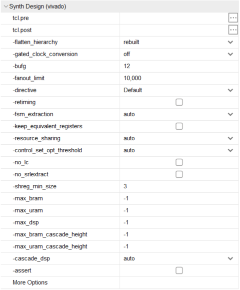

# Vivado学习-综合阶段
> 本节使用版本为 vivado 2018.3
> 本节介绍顺序按照《Vivado从此开始 进阶篇》

综合部分主要分为**综合设置（Synth Design）**和**综合属性**，在vivado的**Flow Navigator**界面找到**SYNTHESIS**右键点击**Synthesis Settings** 即可打开综合设置界面，界面如下

## 综合设置
### tcl.pre
+ 综合前的tcl命令
### tcl.post
+ 综合后的tcl命令
### -flatten_hierarchy
<table>
<tr>
  <th colspan="2">-flatten_hierarchy</th>
</tr>
<tr>
  <td>可选值</td>
  <td >含义</td>
</tr>
<tr>
  <td>full</td>
  <td >综合时将原始设计打平，只保留顶层设计层次，执行边界优化</td>
</tr>
<tr>
  <td>none</td>
  <td>综合时完全保留原始设计层次，不执行边界优化</td>    
</tr>
<tr>
  <td>rebuilt</td>
  <td>综合时将原始设计打平，执行边界优化，综合后将网表文件按照原始设计层次显示，故与原始设计层次相似</td>
</tr>
</table>

+ 当值为none时，工具进行的优化最少，消耗的资源（寄存器）最多。层次保留最完整
+ 当值为full时，工具进行的优化最多，消耗的资源最少，层次被完全打平（只能看到顶层）。
+ 这三个值体现了工具对设计层次完整性和优化力度的折中。
+ 通常情况下使用默认值rebuilt。好处是在使用Vivado Logic Analyzer时，可快速根据层次找到待测信号
+ KEEP_HIERARCHY的优先级高于-flatten_hierarchy，因此，可根据设计需求灵活地对某些层次设置此属性
### -control_set_opt_threshold 
+ 对于同步复位、同步置位和同步使能信号，Vivado会根据-control_set_opt_threshold的设置进行优化，其目的是减少控制集的个数。优化方法》》》》

+ 值为控制信号的扇出个数，表明对小于此值的同步信号进行优化
+ 值越大，被占用的LUT越多；值为0，不优化
+ 通常情况下，按默认值auto运行
+ 控制集百分比，没看懂
### -no_lc
+ 勾选-no_lc时，不允许出现LUT整合
+ LUT整合的好处是减少了对LUT的使用量
+ LUT整合的坏处是可能会导致布线拥塞
### -keep_equivalent_registers
+ 等效寄存器（Equivalent Registers）是指具有同源的寄存器，即共享输入端口（时钟端口和数据端口）的寄存器
+ 通常情况下，建议不勾选，当-keep_equivalent_registers没有被勾选即等效寄存器被合并时，等效寄存器可以有效降低扇出，确保工具可对无意引入的等效寄存器进行优化
+ 对于手工复制的寄存器而言，可通过综合属性keep确保其不被优化
+ 对于全局复位或全局使能信号而言，可通过手工复制寄存器的方式降低扇出、优化时序
### -resource_sharing
+ 对算术运算实现资源共享，只对算术运算，即加法和乘法运算有效
+ 在默认情况下，将-resource_sharing设置为auto即可
### -gated_clock_conversion
+ 用于管理门控时钟(Gated Clock)，它可以将门控时钟信号变为使能信号
+ 门控时钟是指由门电路而非专用时钟模块（如MMCM或PLL）生成的时钟
+ 门控时钟会给设计带来一些负面影响，可通过-gated_clock_conversion消除
+ 当时钟负载少且时钟频率低（如小于5MHz）时，可以适当使用门控时钟。此时建议手工插入BUFG。
### -fanout_limit
+ 全局选项，用于设定信号所能承载的最大负载，即最高的扇出个数，默认值为10000。需注意该选项对设计中的控制信号，如置位、复位和使能信号无效。
+ 采用默认值即可
+ 对于需要明确降低扇出的信号，MAX_FANOUT是可选方法之一。
### -shreg_min_size & -no_srlextract
+ 对于移位寄存器的实现方式，可通过-shreg_min_size进行全局管理，也可通过模块化综合技术中的选项SHREG_MIN_SIZE进行细粒度管理，还可通过综合属性SRL_STYLE进行控制
+ -shreg_min_size用于管理移位寄存器是否映射为LUT，默认值为3。
+ -no_srlextract用于组织工具将移位寄存器映射为LUT。
+ 选项-no_srlextract的优先级高于-shreg_min_size
+ 采用LUT实现的移位寄存器不支持复位
+ 在System Generator中，Delay和Register是不同的
### -fsm_extraction
+ 用于设置状态机的编码方式
+ 综合选项-fsm_extraction的优先级高于RTL代码中指定的编码方式
+ 综合属性FSM_ENCODING的优先级高于-fsm_extraction指定的编码方式
+ 在综合Log文件中，通过搜索encoding或Synth 8-3354可查看状态机对应的编码方式

## 综合属性
### ASYNC_REG
+ ASYNC_REG用于单bit信号采用双（或多）触发器实现异步跨时钟域的场合，此时所有用于同步的触发器都要标记ASYNC_REG
+ 可使用Xilinx 提供的XPM_CDC模板避免遗忘标记ASYNC_REG
### MAX_FANOUT
+ MAX_FANOUT可有效降低扇出，但需要确保复制的寄存器与负载位于同一层次
+ 对于Xilinx IP内部信号，MAX_FANOUT未必生效。此时可借助phys_opt_design中的选项达到优化目的
### SRL_STYLE和SHREG_EXTRACT
+ SRL_STYLE有6个值，用于指导Vivado将移位寄存器映射为何种形式
+ 从时序角度而言，不建议时序路径的终点是移位寄存器，尤其在高速设计中
### USE_DSP
+ USE_DSP可使得加法、减法、或累加运算映射到DSP内。
+ USE_DSP的SIMD模式可将2个位宽为24bit的ALU或4个位宽为12bit的ALU映射到DSP内
### RAM_STYLE和ROM_STYLE
+ RAM_STYLE和ROM_STYLE都可将存储单元映射为Block RAM或分布式RAM。
+ 手工编写HDL代码的优势在于结合RAM_STYLE、ROM_STYLE，可灵活地将RAM或ROM根据设计需求映射为不同的资源
+ 对于UltraRAM，不建议采用手工编写HDL代码，最好使用XPM_MEMORY
### EXTRACT_ENABLE和EXTRACT_RESET
+ EXTRACT_ENABLE可用于控制寄存器是否使用使能信号。当使能端口对应的路径为关键路径时，可尝试将相应逻辑移至数据端口
### MARK_DEBUG
+ MARK_DEBUG可用于快速定位待观测的网线，建议在Elaborated Design时就开始使用
+ MARK_DEBUG的作用对象是网线，而不是Cell

## 模块化综合技术
### 概述
选项是全局的，是应用与所有模块的，意味着某些选项对设计中的某些模块是不合适的。Vivado的模块化综合技术有效解决了这一弊端，实现了对模块的差异化处理。
### 特征
+ 对同一模块可以使用多个选项
+ 模块化综合技术的选项是向下继承的，且可嵌套
+ 模块的层次不受全局选项-flatten_hierarchy的影响
### 应用场景
+ 对不同模块设置不同的综合选项，实现细粒度化管理
+ 对不同模块设置不同的综合策略，本质上仍是对综合选项的设置，但避免了逐个修正不同综合选项的操作

## OOC综合方式
OOC(Out Of Context)综合方式是一种自底向上(Bottom-up)的综合方法，可以应用于IP、IPI的Block Design及用户逻辑中

+ OOC综合方式可以单独生成相应的DCP文件，从而节省编译时间。
+ 不是所有的模块都可以使用OOC综合方式
  